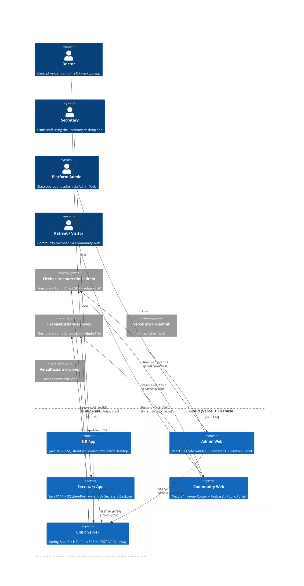
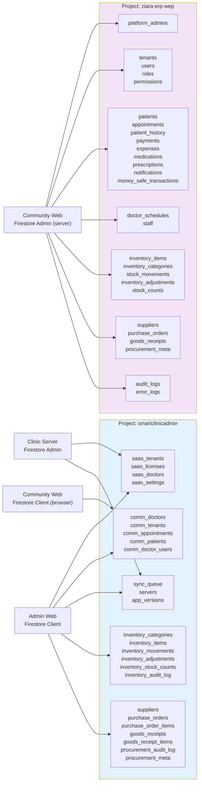

# Ziara Clinic System — Architecture & Data Flow

> Generated 2026-07-10 from live codebase analysis of all 5 apps.

---

## 1. System Architecture Diagram



---

## 2. Component Architecture

```mermaid
C4Component
  Person(doctor, "Doctor")
  Person(secretary, "Secretary")
  Person(admin, "Admin")

  System_Boundary(dr, "DR App (JavaFX Desktop)") {
    Component(dr_ui, "JavaFX UI", "FXML + ControlsFX", "Dashboard, Patients,\nAppointments, Reports")
    Component(dr_sync, "AutoSyncService", "Background Thread", "Periodic push/pull sync\nwith Clinic Server")
    Component(dr_api, "RemoteApiClient (9 modules)", "HTTP + Jackson", "Appointment, Patient, Doctor,\nSecretary, Schedule, Medication,\nExpense, Notification, MoneySafe,\nPatientHistory APIs")
    Component(dr_db, "SQLite Database", "xerial JDBC", "Local cache: patients,\nappointments, doctors,\nmedications, etc.")
    Component(dr_license, "LicenseManager", "HMAC + Firestore", "License validation,\ndevice binding")
    Component(dr_log, "Logging", "SLF4J + Logback", "logs/smartclinic.log\nrolling 30d, async")
  }

  System_Boundary(sec, "Secretary App (JavaFX Desktop)") {
    Component(sec_ui, "JavaFX UI", "FXML + ControlsFX", "Dashboard, Patients,\nAppointments, Payments")
    Component(sec_sync, "AutoSyncService", "Background Thread", "Periodic push/pull sync\nwith Clinic Server")
    Component(sec_api, "RemoteApiClient (6 modules)", "HTTP + Jackson", "Appointment, Patient, Payment,\nExpense, Notification, Secretary APIs")
    Component(sec_db, "SQLite Database", "xerial JDBC", "Local cache: patients,\nappointments, payments")
    Component(sec_log, "Logging", "SLF4J + Logback", "logs/smartclinic-sec.log\nrolling 30d, async")
  }

  System_Boundary(srv, "Clinic Server (Spring Boot)") {
    Component(srv_rest, "REST Controllers (17)", "Spring MVC", "Full CRUD for all entities\n+ license + update + sync")
    Component(srv_auth, "Auth Layer", "JWT + Spring Security", "Doctor/Secretary/Admin login\nToken refresh & revocation")
    Component(srv_license, "License Service", "Firestore Admin SDK", "Validate, sync, report\nlicense usage")
    Component(srv_sync, "Sync Engine", "Updated-since + Push", "Bidirectional sync with\nboth desktop apps")
    Component(srv_update, "Update Manager", "Firestore", "Version publishing &\nupdate checking")
    Component(srv_h2, "H2 Database (16 tables)", "Embedded SQL", "Primary server storage\n+ Hibernate ORM")
    Component(srv_firebase, "Firebase Bridge", "Admin SDK", "Read/write saas_licenses,\ncomm_*, sync_queue")
    Component(srv_log, "Logging", "Logback JSON", "JSON structured logging\nrolling 30d, async")
  }

  System_Boundary(web1, "Admin Web (React + Vite)") {
    Component(aw_ui, "MUI Components", "React 19 + MUI", "Login, Licenses, Tenants,\nDoctors, Updates, Settings")
    Component(aw_auth, "Auth Context", "Firebase Auth", "Email/password login\nSession management")
    Component(aw_fb, "Firestore Service", "Firebase SDK", "CRUD: saas_tenants,\nsaas_licenses, saas_doctors,\nsaas_settings, etc. (23 collections)")
    Component(aw_notif, "Notification Context", "MUI Snackbar", "Global toast system\n4 severity levels")
  }

  System_Boundary(web2, "Community Web (Next.js)") {
    Component(cw_api, "API Routes (30+)", "Next.js Route Handlers", "Server-side CRUD for\npatients, appointments,\ninventory, procurement, etc.")
    Component(cw_auth, "Auth API", "Firebase Auth", "Session management\nRole-based access")
    Component(cw_fb, "Firestore Admin", "firebase-admin SDK", "Server-side operations\non 30+ collections")
    Component(cw_fbc, "Firestore Client", "Firebase Client SDK", "Client-side reads &\ncommunity features")
    Component(cw_err, "Error Logger", "Firestore persistence", "captureError() + writeErrorLog()\nerror_logs collection")
  }

  Rel(doctor, dr_ui, "Interacts with")
  Rel(secretary, sec_ui, "Interacts with")
  Rel(admin, aw_ui, "Interacts with")

  Rel(dr_ui, dr_sync, "Triggers sync")
  Rel(dr_sync, dr_api, "Calls")
  Rel(dr_api, srv_rest, "HTTP REST", "JWT + JSON")
  Rel(dr_ui, dr_db, "Reads/Writes")
  Rel(dr_license, srv_license, "Validates via")

  Rel(sec_ui, sec_sync, "Triggers sync")
  Rel(sec_sync, sec_api, "Calls")
  Rel(sec_api, srv_rest, "HTTP REST", "JWT + JSON")
  Rel(sec_ui, sec_db, "Reads/Writes")

  Rel(srv_rest, srv_auth, "Authenticates")
  Rel(srv_rest, srv_h2, "Reads/Writes")
  Rel(srv_rest, srv_license, "Validates")
  Rel(srv_rest, srv_sync, "Syncs")
  Rel(srv_rest, srv_update, "Manages")
  Rel(srv_license, srv_firebase, "Firestore Admin SDK")

  Rel(aw_fb, firebase1, "Firestore Client SDK")
  Rel(cw_fb, firebase2, "Firestore Admin SDK")
  Rel(cw_fbc, firebase1, "Firestore Client SDK")
  Rel(cw_api, cw_fb, "Uses")

  UpdateLayoutConfig($c4ShapeInRow="3", $c4BoundaryInRow="1")
```

---

## 3. Data Flow Diagram (Level 1)

```mermaid
flowchart TB
  subgraph External["External Entities"]
    D[("Doctor")]
    S[("Secretary")]
    A[("Platform Admin")]
    P[("Patient / Visitor")]
  end

  subgraph Desktop["Desktop Apps (LAN)"]
    DR["DR App\n(JavaFX + SQLite)"]
    SEC["Secretary App\n(JavaFX + SQLite)"]
  end

  subgraph Server["Server (LAN)"]
    CS["Clinic Server\n(Spring Boot + H2)\nPort 8081"]
    H2[("H2 Database\n16 tables")]
  end

  subgraph Cloud["Cloud (Vercel + Firebase)"]
    subgraph FB1["Firebase: smartclinicadmin"]
      F1_SAAS["saas_tenants\nsaas_licenses\nsaas_doctors\nsaas_settings"]
      F1_COMM["comm_doctors\ncomm_tenants\ncomm_appointments\ncomm_patients"]
      F1_SYNC["sync_queue\nservers\napp_versions"]
      F1_INV["inventory_*\nprocurement_*"]
    end

    subgraph FB2["Firebase: ziara-erp-wep"]
      F2_ERP["tenants\nusers\nroles\npermissions"]
      F2_CLINIC["patients\nappointments\npayments\nexpenses\nmedications"]
      F2_INV["inventory_*\nprocurement_*\nsuppliers"]
      F2_AUDIT["audit_logs\nerror_logs"]
    end

    ADMIN["Admin Web\n(React + Vite)"]
    COMM["Community Web\n(Next.js)"]
  end

  D -->|"Interacts"| DR
  S -->|"Interacts"| SEC
  A -->|"Interacts"| ADMIN
  P -->|"Interacts"| COMM

  %% Dr App flows
  DR -->|"POST /api/doctors/login"| CS
  DR -->|"GET/POST/PUT/DELETE\n/api/appointments/*"| CS
  DR -->|"GET/POST/PUT/DELETE\n/api/patients/*"| CS
  DR -->|"GET/POST/PUT/DELETE\n/api/doctors/*"| CS
  DR -->|"GET/POST/PUT/DELETE\n/api/secretaries/*"| CS
  DR -->|"GET/POST/PUT/DELETE\n/api/schedule/*"| CS
  DR -->|"GET/POST/PUT/DELETE\n/api/medications/*"| CS
  DR -->|"GET/POST/PUT/DELETE\n/api/expenses/*"| CS
  DR -->|"GET/PUT\n/api/notifications/*"| CS
  DR -->|"GET /api/money-safe/*"| CS
  DR -->|"GET/POST/PUT/DELETE\n/api/history/*"| CS

  %% Sec App flows
  SEC -->|"POST /api/secretaries/login"| CS
  SEC -->|"GET/POST/PUT/DELETE\n/api/appointments/*"| CS
  SEC -->|"GET/POST/PUT/DELETE\n/api/patients/*"| CS
  SEC -->|"GET/POST/PUT/DELETE\n/api/payments/*"| CS
  SEC -->|"GET/POST/PUT/DELETE\n/api/expenses/*"| CS
  SEC -->|"GET/PUT\n/api/notifications/*"| CS
  SEC -->|"GET/POST/PUT/DELETE\n/api/secretaries/*"| CS

  %% Server internal flows
  CS <-->|"JPA/Hibernate"| H2
  CS -->|"POST /api/license/*\nFirestore Admin SDK"| F1_SAAS
  CS -->|"POST /api/sync/push\nFirestore Admin SDK"| F1_SYNC

  %% Admin Web flows
  ADMIN -->|"Firebase Auth + Firestore\nClient SDK"| F1_SAAS
  ADMIN -->|"Firestore Client SDK"| F1_COMM
  ADMIN -->|"Firestore Client SDK"| F1_SYNC
  ADMIN -->|"Firestore Client SDK"| F1_INV
  ADMIN -->|"POST /api/admin/login\nGET /api/admin/*"| CS

  %% Community Web flows
  COMM -->|"Server-side\nFirestore Admin SDK"| F2_ERP
  COMM -->|"Server-side\nFirestore Admin SDK"| F2_CLINIC
  COMM -->|"Server-side\nFirestore Admin SDK"| F2_INV
  COMM -->|"Server-side\nFirestore Admin SDK"| F2_AUDIT
  COMM -->|"Client-side\nFirestore SDK"| F1_COMM
  COMM -->|"Server-side\nFirestore Admin SDK"| F1_SAAS

  %% License flow
  CS -->|"POST /api/license/validate"| F1_SAAS

  style D fill:#e1f5fe
  style S fill:#e1f5fe
  style A fill:#e1f5fe
  style P fill:#e1f5fe
  style DR fill:#fff3e0
  style SEC fill:#fff3e0
  style CS fill:#f3e5f5
  style ADMIN fill:#e8f5e9
  style COMM fill:#e8f5e9
```



---

## 4. Firestore Collection Map



---

## 5. REST API Endpoint Map

### Server Controllers

| Controller | Base Path | Operations |
|---|---|---|
| **AdminController** | `/api/admin` | `login`, `change-password`, `metrics/notifications`, `bootstrap` |
| **AuthController** | `/api/auth` | `refresh`, `revoke`, `revoke-all` |
| **LicenseController** | `/api/license` | `validate`, `validate-server`, `sync`, `report`, `error-report`, `status`, `expiry-info`, `admin/*` |
| **SyncPushController** | `/api/sync` | `push` |
| **UpdateCheckController** | `/api/update` | `check`, `admin/*` |
| **HealthController** | `/api` | `health`, `health/stats` |
| **PatientController** | `/api/patients` | CRUD + `search`, `find-by-phone`, `recent`, `{id}/history`, `updated-since` |
| **AppointmentController** | `/api/appointments` | CRUD + `today`, `range`, `updated-since`, `{id}/checkin`, `{id}/complete` |
| **DoctorController** | `/api/doctors` | CRUD + `login`, `check-username`, `register` |
| **SecretaryController** | `/api/secretaries` | CRUD + `login`, `check-username`, `test` |
| **PaymentController** | `/api/payments` | CRUD + `patient/{id}`, `patient/{id}/summary`, `updated-since` |
| **ExpenseController** | `/api/expenses` | CRUD + `pending`, `approved`, `summary`, `updated-since`, `{id}/approve`, `{id}/reject`, `{id}/unapprove` |
| **PatientHistoryController** | `/api/history` | CRUD + `patient/{id}`, `updated-since` |
| **MedicationController** | `/api/medications` | CRUD + `patient/{id}` |
| **DoctorScheduleController** | `/api/schedule` | CRUD + `cancelled`, `{id}/cancel`, `cancel` (by date/timezone) |
| **NotificationController** | `/api/notifications` | CRUD + `count/unread`, `{id}/seen`, `seen/all` |
| **MoneySafeController** | `/api/money-safe` | `balance`, `transactions`, `transactions/all`, `report/daily`, `report/monthly` |

### H2 Database Schema (16 tables)

```
appointments            - id, patient_id, doctor_id, date, time_slot, status, ...
doctors                 - id, name, username, password_hash, phone, ...
secretaries             - id, name, username, password_hash, ...
patients                - id, name, phone, email, dob, deleted_at, ...
payments                - id, patient_id, amount, method, status, ...
expenses                - id, description, amount, status, created_by, ...
patient_history         - id, patient_id, diagnosis, notes, created_at, ...
medications             - id, patient_id, name, dosage, frequency, ...
doctor_schedule         - id, doctor_id, date, time_zone, cancelled, ...
money_safe_transactions - id, type, amount, description, ...
schedule_notifications  - id, patient_id, type, message, status, ...
licenses                - id, license_key, status, device_fingerprint, ...
bootstrap_state         - id, step, completed, ...
password_reset_tokens   - id, user_id, token, expires_at, ...
refresh_tokens          - id, user_id, token, expires_at, ...
patient_notification_preferences - id, patient_id, email, sms, ...
```

---

## 6. Key Data Flows

### License Validation Flow
```
Desktop App → POST /api/license/validate → Server → Firestore (saas_licenses)
                ↓
            Response: { status: "VALID"|"EXPIRED"|"INVALID", locked: bool }
                ↓
Desktop App: unlocks feature or shows locked dialog
```

### Sync Flow (Desktop → Server)
```
Desktop App → POST /api/{entity}/updated-since?timestamp=... → Server
                ↓
            Server queries H2 for records modified since timestamp
                ↓
            Returns JSON array of changed records
                ↓
Desktop App merges into local SQLite
```

### Booking Flow (Community Web → Clinic Server)
```
Patient → Community Web → POST /api/community/bookings
                ↓
            Community Web writes to comm_appointments (Firestore)
                ↓
            Clinic Server polls comm_appointments via sync_queue
                ↓
            Server creates appointment in H2 + notifies Dr App
```

### Error Reporting Flow
```
Any App → captureError() → console.error (client)
          writeErrorLog() → Firestore (server) → error_logs collection
          serverError() → console + Firestore + HTTP 500 response
```
